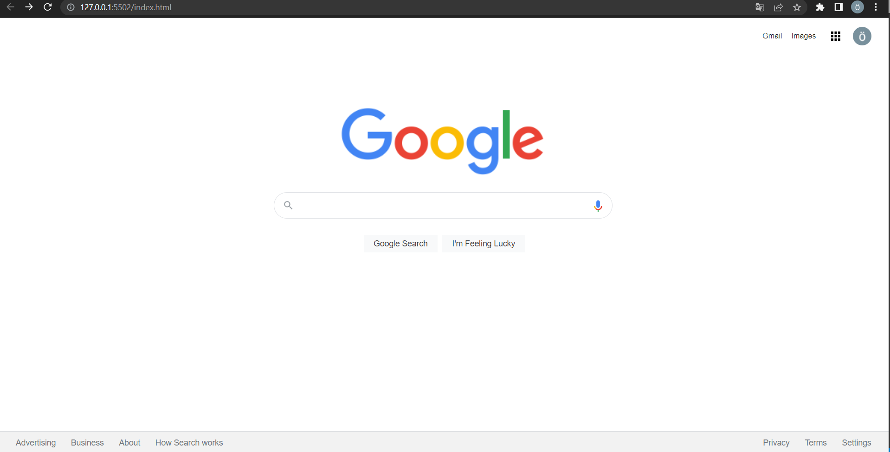

# CSS ÜÇÜNCÜ ÖDEV
-----
## Güncel Google Sayfası Oluşturma
***
### *[Patika](www.patika.dev)*'nın Front-end patikası, CSS derleri kapsamında yaptığım üçüncü ve son ödev

##### Bu ödevde bize verilen dosya üzerinde değişiklikler yaparak Google'ın güncel arama sayfasını oluşturdum

- Assets klasörü içinde "Ses ile arama özelliği" simgesi png olarak verildiği için, arama kısmına img etiketi ile yerleştirdim.
- Hover ve curser özelliklerini daha detaylı kullanmayı öğrendim.
- Flex yapısnı araştırdım öğrendim ve kullandım.
- Flex yapısı altında çalışacağım bir kaç yeni özellik öğrendim.
- Renk, hover detayları, gölgeler, fontlar ve genel yapı için google sayfasını çok fazla inceledim ve CSS yapısını kendi ödevime geçirdim.
-----
**Proje Ekran Görüntüsü**

